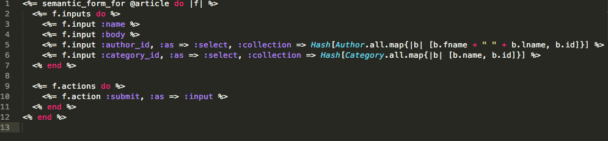
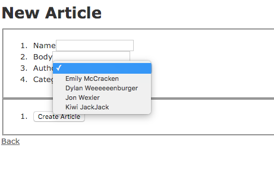
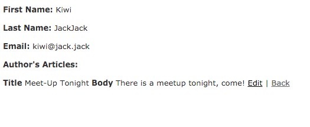

<h1> Formtastic Gem Demo </h1>
<h3> Emily McCracken </h3>
<a href="https://github.com/justinfrench/formtastic">Formtastic Gem Github</a>

<h2> Overview </h2>
Created a Rails app with 3 models and 3 controllers to display the functionality of the Formtastic gem and how it can make building forms in a multi-model app much easier!

<h2> Getting Set Up... </h2>
First, add the Formtastic gem to the Gemfile of your new app: 
```
gem 'formtastic', '~> 3.0'. 
```
<br>
Then run this on your command line: 
```
rails generate formtastic:install.
<<<<<<< HEAD

After all of that is completed, go into your app and go to app/assets/stylesheets/application.css and put in:

```
<br>
 *= require formtastic
 <br>
*= require my_formtastic_changes
```
=======
```

After all of that is completed, go into your app and go to 
```
app/assets/stylesheets/application.css
```
and put in:
 ```
  *= require formtastic
  *= require my_formtastic_changes
  ```
>>>>>>> b50e2d6bc0e21fb0959df363e4e69d9773c09488

Finally, go back to your command line and put: 
```
touch app/assets/stylesheets/my_formtastic_changes.css.
```

<h3> You're all set up and ready to have FORMTASTIC forms!! </h3>

<p> PSA: if you are primarily using ie6 or ie7, please refer to Justin French's original documentation for further setup instructions </p>

<h2> Starting Your App </h2>
I suggest using 'rails generate scaffold' to create your app structure. For example, I started with 
```
rails generate scaffold Category name:string
```
and it created my model, controller (with actions) and views (with forms rendered and links to get around). 

You may of course want to rework some of this structuring as you get deeper into creating your app for your needs but Formtastic does an amazing job starting you off. 

<h2> Relationship Connection Feature </h2>
One of my favorite features of Formtastic is how easy it makes relationships/associations between models. As long you have your models set up correctly (belongs_to, has_many, etc) then Formtastic will recognize your relationship and act according. 

In my example above, I have a Category model (with name), an Author model (with fname, lname and email) and an Article model (with name, body, category_id and author_id). I also have my models set up so that Articles belong to a category and an author while Categories and Authors have many articles. 

I need my articles to take in a category_id and author_id when creating a new one -- Formtastic makes this incredibly simple! 

When formtastic automatically generates your forms, it includes input selections for each column in your model. By adding a little bit of extra code to the inputs for category_id and author_id, you can link your relationships with ease. 



As you can see in the photo above, adding 
```
:as => :select, :collection => Hash[Category.all.map{|b| [b.name, b.id]}]
```
in the 'input' line creates that relationship association when a form is submitted. 

This now will dynamically populate the drop downs for 'category' and 'author'. When a new category or author are created, it will automatically appear in the drop down list when someone is making a new article. 


<br>


And now you can call on this relationship easily! 

For instance, you can list the articles attached to an author by calling:
```
    <% @author.articles.each do |article| %><br>
      	<br>
        <td><%= article.name %></td><br>
        <td><%= article.body %></td><br>
    <% end %><br>
```

and it will display the articles that have that author_id associated with them through the Formtastic forms! 

The above example incorporates ruby code and code determined by Formtastic. 

Here is how it would render on the 'show' page for an Author: 



<h2> Other Features! </h2>

Some other features I implemented... 

<h4> 1. Hints: </h4>
Hints are put in the same line as the 'input' part of the form.

Example: 
```
<%= f.input :email, :hint => "must be a valid email to proceed!"%>
```

>This will show while a user is filling out a form. It is helpful for when you want them to have some extra information to help them fill out your forms. 

<h4> 2. Labels: </h4>
Labels are put in the same line as the 'input' part of the form.

Example: 
```
<%= f.input :lname, :label => "Last Name"%>
```

>This is useful for when you want something different to display to the user than what you have in your models. In this case, I used 'lname' as a column in my model but wanted "Last Name" displayed to user when they were filling out my form. 

<h4> 3. Validation Errors </h4>
These are automatically rendered by Formtastic when you add validations to your models. In the example below, I have a validation to make sure a new article can't be submitted without a name. The below code would be in your model.rb for the model you want to have validations.

Example: 
```
validates_presence_of :name
```

>Formtastic will automatically an a '*' next to any field of your form that has a presence validation so that your user knows it is a required field. Also, if the user tries to submit without that field, Formtastic automatically renders an error message that the field can't be blank. See below image. 


<h2> Documentation & Resources! </h2>
I recommend these sites for more information and to delve deeper into Formtastic!
<br>
Also, thanks to these sites for helping me!
<br>
http://www.rubydoc.info/gems/formtastic/3.1.3
<br>
http://buildingrails.com/a/formtastic_forms_in_rails_for_beginners
<br>
http://railscasts.com/episodes/184-formtastic-part-1


