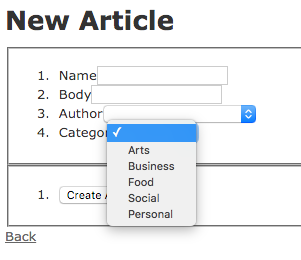

<h1> Formtastic Gem Demo </h1>
<h3> Emily McCracken </h3>
<a href="https://github.com/justinfrench/formtastic">Formtastic Gem Github</a>

<h2> Overview </h2>
Created a Rails app with 3 models and 3 controllers to display the functionality of the Formtastic gem and how it can make building forms in a multi-model app much easier!

<h2> Getting Set Up... </h2>
First, add the Formtastic gem to the Gemfile of your new app:  gem 'formtastic', '~> 3.0'. 
 
Then bundle install. 
 
Then also run this on your command line: 
 
rails generate formtastic:install.

After all of that is completed, go into your app and go to app/assets/stylesheets/application.css and put in:
 
  *= require formtastic
   
  *= require my_formtastic_changes

Finally, go back to your command line and put: touch app/assets/stylesheets/my_formtastic_changes.css.

<h3> You're all set up and ready to have FORMTASTIC forms!! </h3>

 PSA: if you are primarily using ie6 or ie7, please refer to Justin French's original documentation for further setup instructions 

<h2> Starting Your App </h2>
I suggest using 'rails generate scaffold' to create your app structure. For example, I started with 'rails generate scaffold Category name:string' and it created my model, controller (with actions) and views (with forms rendered and links to get around). You may of course want to rework some of this structuring as you get deeper into creating your app for your needs but Formtastic does an amazing job starting you off. 

<h2> Relationship Connection Feature </h2>
One of my favorite features of Formtastic is how easy it makes relationships/associations between models. As long you have your models set up correctly (belongs_to, has_many, etc) then Formtastic will recognize your relationship and act according. 

In my example above, I have a Category model (with name), an Author model (with fname, lname and email) and an Article model (with name, body, category_id and author_id). I also have my models set up so that Articles belong to a category and an author while Categories and Authors have many articles. I need my articles to take in a category_id and author_id when creating a new one -- Formtastic makes this incredibly simple! 

When formtastic automatically generates your forms, it includes input selections for each column in your model. By adding a little bit of extra code to the inputs for category_id and author_id, you can link your relationships with ease. 

This now will dynamically populate the drop downs for 'category' and 'author'. When a new category or author are created, it will automatically appear in the drop down list when someone is making a new article. 

 

